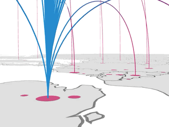

# Whats

https://github.com/visgl/hubble.gl

# Howto

install dependencies within hubble.gl

```
cd 01-hubblegl-site-examples
yarn bootstrap
```

## standalone


```

# To install example go to the folder
cd examples/standalone

# do this once per example
yarn

# To run the example
yarn start-local
```

## pure-js



```

# To install example go to the folder
cd examples/pure-js

# do this once per example
yarn

# To run the example
yarn start-local
```

## trips


```
# install dependencies within hubble.gl root
yarn bootstrap

# To install example go to the folder
cd examples/trips

# do this once per example
yarn

```

#### environment file copy

```
cp .env.sample .env
```

To see the base map, you need a [Mapbox access token](https://docs.mapbox.com/help/how-mapbox-works/access-tokens/). You can either set an environment variable:

set mapbox access token

```
MapboxAccessToken=pk.xxxxxxxxxxxxx
```

#### To run the example

```
yarn start-local
```
