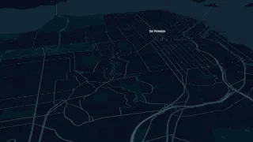

# Worldview App

Worldview is a web app you can use to create fully customizable animated map videos in seconds without any installation or expensive server processing by utilizing hubble.gl.



#### 1. Install

```sh
yarn
```

#### 2. Mapbox Token

Add mapbox access token to env.

#### file copy

```
cp .env.sample .env
```

set mapbox access token

```
MapboxAccessToken=pk.xxxxxxxxxxxxx
```

~~export MapboxAccessToken=<mapbox_access_token>~~

#### 3. Start the app

```sh
yarn start-local
```
